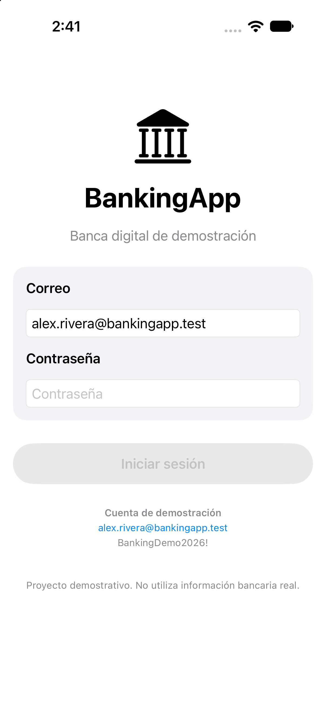
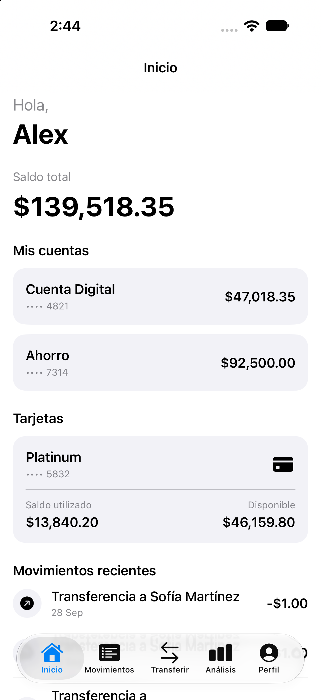
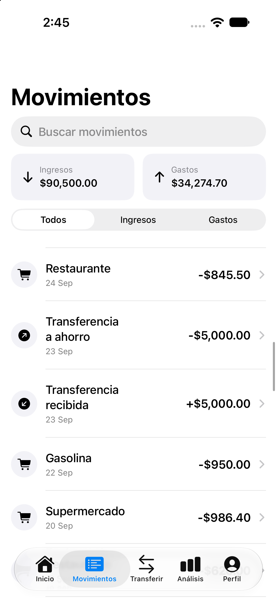
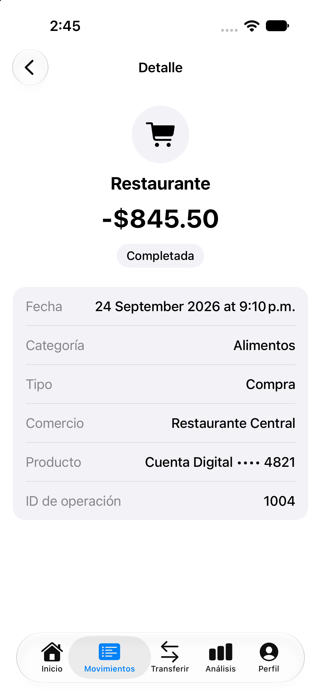
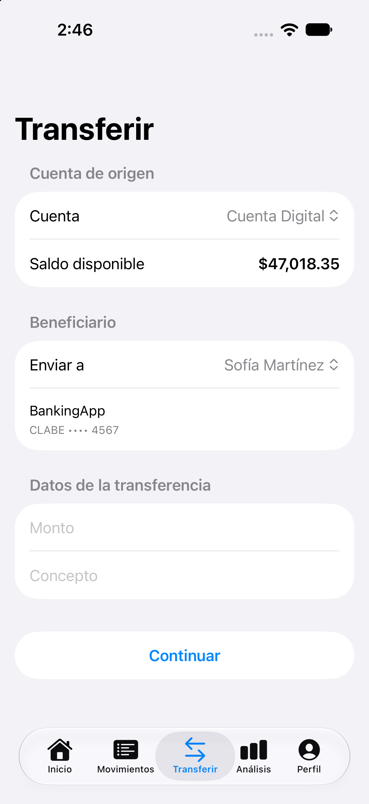
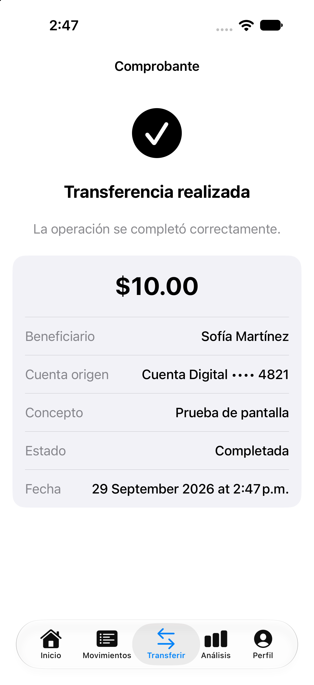
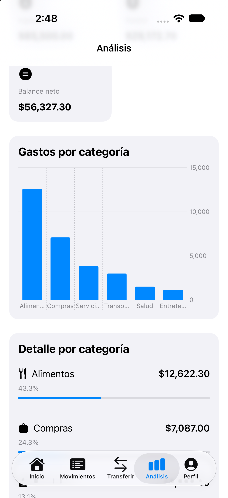
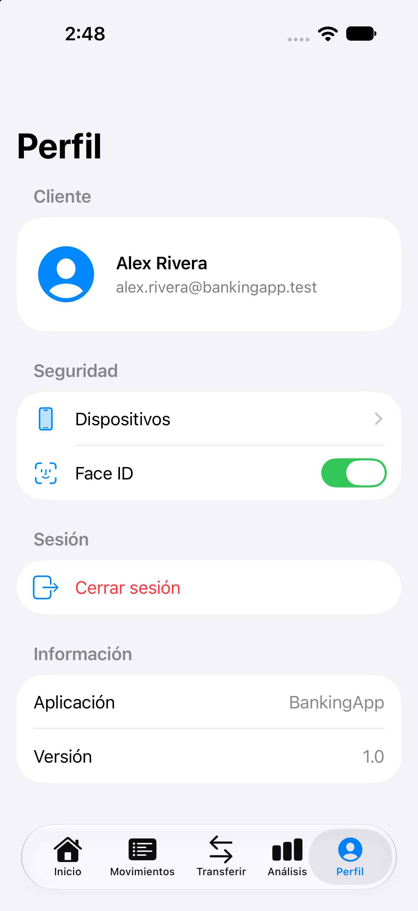

# BankingApp iOS

A full-stack digital banking portfolio application built with **Swift, SwiftUI, Java, Spring Boot, REST APIs, and MySQL**.

BankingApp simulates a mobile banking environment where users can authenticate securely, review banking products and transaction history, transfer funds to registered beneficiaries, analyze financial activity, manage trusted devices, and use biometric authentication.

The project was designed as a hands-on implementation of mobile development, backend integration, relational databases, API security, transaction processing, and software architecture.

> **Portfolio project:** BankingApp uses fictional customers and simulated banking data. It is not connected to a real financial institution or payment network.

---

## Features

### Authentication and security

- Email and password authentication through the backend.
- BCrypt password hashing.
- JWT-based API authentication.
- Stateless Spring Security configuration.
- JWT storage in the iOS Keychain.
- Face ID / Touch ID integration using LocalAuthentication.
- Biometric session restoration.
- Customer-level authorization for protected resources.
- Automatic rejection of missing, invalid, or expired tokens.
- Sensitive backend credentials supplied through environment variables.

### Banking products

Users can view:

- Checking / debit accounts.
- Savings accounts.
- Credit cards.
- Available and current balances.
- Recent banking activity.
- Registered beneficiaries.
- Trusted and untrusted devices.

### Transaction history

The application retrieves transaction information from the REST API and provides:

- Transaction list.
- Transaction details.
- Income and expense information.
- Historical banking activity.

### Transfers

BankingApp implements an end-to-end transfer flow:

1. The user selects a source account.
2. A registered beneficiary is selected.
3. The transfer amount and description are entered.
4. The backend validates the authenticated customer.
5. The backend evaluates the transfer risk.
6. Account records are locked during balance modification.
7. The source account is debited.
8. The destination account is credited.
9. The transfer and related banking transactions are persisted.
10. The iOS application receives the result and displays a transfer receipt.

Balance changes therefore occur in the database rather than only in the user interface.

### Rule-based risk evaluation

Transfers are evaluated by a backend risk engine.

The current rules include:

| Condition | Risk points |
| --- | ---: |
| Transfer amount greater than 20,000 | +30 |
| Untrusted device | +25 |
| Beneficiary added less than 24 hours ago | +20 |
| Third transfer within a 10-minute period | +20 |
| Transfer between 00:00 and 05:59 | +10 |

Risk levels:

| Score | Level |
| --- | --- |
| 0–29 | Low |
| 30–59 | Medium |
| 60+ | High |

High-risk operations require additional verification in the simulated banking workflow.

### Financial analysis

The application includes financial analysis based on customer transaction data, allowing the iOS client to present summarized banking activity retrieved from the backend.

---

## Technology stack

### iOS

- Swift
- SwiftUI
- MVVM
- async/await
- URLSession
- LocalAuthentication
- Keychain Services
- Swift Testing
- XCTest UI
- Xcode

### Backend

- Java 21
- Spring Boot
- Spring Web
- Spring Data JPA
- Hibernate
- Spring Security
- JWT
- BCrypt
- Maven

### Database

- MySQL
- Relational modeling
- Primary and foreign keys
- Constraints
- Transactions
- Pessimistic locking
- Seed data

### Development workflow

- Git
- GitHub
- REST / JSON
- Environment variables
- Layered backend architecture

---

## Architecture

BankingApp is divided into three main components:

```text
┌──────────────────────────────┐
│          iOS App             │
│                              │
│  Swift + SwiftUI + MVVM      │
│  Keychain + LocalAuth        │
└──────────────┬───────────────┘
               │
               │ REST / JSON
               │ Bearer JWT
               ▼
┌──────────────────────────────┐
│       Spring Boot API        │
│                              │
│ Controllers                  │
│ Services                     │
│ Security                     │
│ Risk Engine                  │
│ Repositories                 │
└──────────────┬───────────────┘
               │
               │ JPA / Hibernate
               ▼
┌──────────────────────────────┐
│            MySQL             │
│                              │
│ Customers                    │
│ Accounts                     │
│ Cards                        │
│ Transactions                 │
│ Transfers                    │
│ Risk evaluations             │
└──────────────────────────────┘
```

The iOS application does not access MySQL directly. All banking operations are performed through the REST API.

---

## iOS architecture

The iOS application follows an MVVM-oriented structure.

```text
Views
  │
  ▼
ViewModels
  │
  ▼
Services / Networking
  │
  ▼
REST API
```

### Views

SwiftUI views are responsible for presentation and user interaction.

Main application sections:

- Home
- Transactions
- Transfer
- Analysis
- Profile

### ViewModels

ViewModels coordinate UI state and application operations.

Examples include:

- `HomeViewModel`
- `TransactionsViewModel`
- `TransferViewModel`
- `AnalysisViewModel`

### Networking

`APIClient` centralizes HTTP communication.

The networking layer handles:

- GET requests.
- POST requests.
- JSON encoding and decoding.
- Bearer token injection.
- HTTP status validation.
- Authentication failures.
- Backend error responses.

### Session management

`SessionManager` coordinates authentication state.

The authentication flow is:

```text
Credentials
    │
    ▼
POST /api/auth/login
    │
    ▼
JWT
    │
    ▼
iOS Keychain
    │
    ▼
Authenticated REST requests
```

When biometric authentication is enabled, Face ID or Touch ID can be used to restore an existing authenticated session.

---

## Backend architecture

The backend uses a layered architecture:

```text
Controller
    │
    ▼
Service
    │
    ▼
Repository
    │
    ▼
JPA / Hibernate
    │
    ▼
MySQL
```

### Controllers

Controllers expose the REST interface and receive HTTP requests.

### Services

Services contain business logic such as:

- Authentication.
- Customer information retrieval.
- Financial analysis.
- Transfer processing.
- Risk evaluation.

### Repositories

Spring Data JPA repositories provide persistence operations between the application and MySQL.

The backend is implemented as a **modular monolith**. It does not claim to use microservices.

---

## Database model

The relational database contains the following principal tables:

```text
CUSTOMER
ACCOUNT
CREDIT_CARD
BANK_TRANSACTION
BENEFICIARY
DEVICE
TRANSFER
RISK_EVALUATION
RISK_REASON
AUTH_CREDENTIAL
```

Important relationships include:

```text
CUSTOMER
   │
   ├── ACCOUNT
   ├── CREDIT_CARD
   ├── BENEFICIARY
   ├── DEVICE
   └── AUTH_CREDENTIAL

ACCOUNT
   │
   └── BANK_TRANSACTION

TRANSFER
   │
   └── RISK_EVALUATION
          │
          └── RISK_REASON
```

Money values use fixed-precision database types rather than floating-point storage.

---

## Transfer consistency and concurrency

Transfers modify financial balances and therefore require stronger consistency guarantees than ordinary read operations.

The backend performs transfer processing inside a transactional service.

Account records involved in a transfer are acquired using pessimistic write locks.

To reduce deadlock risk when two accounts participate in concurrent transfers, the application locks account IDs in a deterministic order before modifying balances.

After locking, critical conditions such as account ownership, account state, and available balance are validated before the debit and credit are performed.

This design helps prevent concurrent requests from independently spending the same available balance.

---

## REST API

The main API routes include:

```text
POST /api/auth/login

GET  /api/customers/{customerId}
GET  /api/customers/{customerId}/accounts
GET  /api/customers/{customerId}/credit-cards
GET  /api/customers/{customerId}/transactions
GET  /api/customers/{customerId}/analysis

GET  /api/customers/{customerId}/beneficiaries

POST /api/transfers
```

Protected endpoints require:

```text
Authorization: Bearer <JWT>
```

The backend validates both authentication and resource ownership. A valid token for one customer cannot be used to access another customer's protected banking information.

---

## API error handling

The project handles common API failure scenarios including:

- Missing authentication.
- Invalid credentials.
- Invalid or expired JWT.
- Forbidden operations.
- Invalid transfers.
- Insufficient funds.
- Backend errors.
- Network failures.
- JSON decoding failures.

Authentication errors can invalidate the current local session when appropriate.

---

## Testing

The iOS project contains both unit and UI tests.

Current validated iOS test suite:

```text
16 / 16 tests passing
```

The test suite includes coverage for application logic, session/biometric-related behavior, REST integration, and UI execution.

The Spring Boot project also contains an application context test and was validated through Maven during development.

Security behavior such as authentication, token expiration, resource ownership, and forbidden cross-customer transfer attempts was additionally verified during backend integration testing.

---

## Demo data

The database seed contains fictional banking information for three customers with different products, balances, devices, beneficiaries, and transaction histories.

The dataset contains more than one hundred historical banking transactions, allowing the application to demonstrate transaction history and financial analysis without using real financial information.

Demo credentials are intended only for local portfolio execution.

---

## Running the project locally

### Requirements

You will need:

- macOS
- Xcode
- Java 21
- MySQL
- Git

The project is designed to run locally with the following architecture:

```text
iOS Simulator
      │
      ▼
localhost:8080
Spring Boot
      │
      ▼
localhost:3306
MySQL
```

---

## 1. Clone the repository

```bash
git clone git@github.com:jonuettr/BankingApp-iOS.git
cd BankingApp-iOS
```

---

## 2. Create the MySQL database

The database scripts are located in:

```text
Database/schema.sql
Database/seed.sql
```

Create the schema first and then load the demo data.

Example:

```bash
mysql -u root -p < Database/schema.sql
mysql -u root -p < Database/seed.sql
```

The exact command may vary depending on the local MySQL installation and database configuration.

---

## 3. Configure backend environment variables

Sensitive values are intentionally not stored in the repository.

The backend expects:

```text
DB_PASSWORD
JWT_SECRET
```

Example for a local development terminal:

```bash
export DB_PASSWORD='your-local-database-password'
export JWT_SECRET='your-development-jwt-secret'
```

A JWT secret can also be generated locally, for example:

```bash
openssl rand -hex 32
```

Do not commit real credentials or production secrets to the repository.

---

## 4. Start the Spring Boot API

```bash
cd API
./mvnw spring-boot:run
```

By default, the API runs locally on:

```text
127.0.0.1:8080
```

The backend connects to the local MySQL database configured in `application.properties`.

---

## 5. Run the iOS application

Open:

```text
BankingApp/BankingApp.xcodeproj
```

Then:

1. Select an iPhone Simulator.
2. Build and run the application.
3. Make sure the Spring Boot backend is running.
4. Log in using a demo customer account.

The development configuration communicates with the API running on the local machine.

---

## Biometrics in the iOS Simulator

Face ID can be tested using the simulator biometric controls.

After enabling biometric authentication inside BankingApp:

1. Stop and relaunch the application.
2. Trigger the simulated Face ID authentication.
3. Use the simulator's matching biometric option when prompted.

The JWT remains protected by the iOS Keychain while biometric authentication controls restoration of the local banking session.

---

## Cloud deployment architecture

BankingApp v1.0 is designed and demonstrated as a locally executable full-stack portfolio project.

A production-style evolution could deploy the same separation of responsibilities using cloud infrastructure:

```text
┌─────────────────────────┐
│        iOS Client       │
└────────────┬────────────┘
             │
             │ HTTPS
             ▼
┌─────────────────────────┐
│ Cloud-hosted            │
│ Spring Boot API         │
└────────────┬────────────┘
             │
             │ Private DB connection
             ▼
┌─────────────────────────┐
│ Managed MySQL Database  │
└─────────────────────────┘
```

In that architecture:

- The iOS client would communicate with the backend through HTTPS.
- The Spring Boot API would run in a cloud compute environment.
- MySQL could be migrated to a managed relational database service.
- `DB_PASSWORD`, `JWT_SECRET`, database URLs, and other environment-specific values would be supplied through secure cloud configuration rather than source code.
- The database would not be directly exposed to the iOS application.

Cloud deployment is documented as an architectural extension and is **not required to run BankingApp v1.0 locally**.

This repository does not claim that the current version is actively deployed to a public cloud environment.

---

## Repository structure

```text
BankingApp-iOS/
│
├── API/
│   ├── src/main/java/
│   ├── src/main/resources/
│   ├── src/test/
│   └── pom.xml
│
├── BankingApp/
│   ├── BankingApp/
│   │   ├── Models/
│   │   ├── Networking/
│   │   ├── Services/
│   │   ├── ViewModels/
│   │   └── Views/
│   ├── BankingAppTests/
│   └── BankingAppUITests/
│
├── Database/
│   ├── schema.sql
│   └── seed.sql
│
├── LICENSE
└── README.md
```

---

## Project scope

BankingApp is a portfolio and learning project focused on demonstrating:

- Native iOS development.
- Swift and SwiftUI.
- MVVM.
- Object-oriented programming.
- REST API consumption.
- Java and Spring Boot.
- Relational database design.
- SQL.
- Authentication and authorization.
- JWT.
- Keychain integration.
- Biometric authentication.
- Transactional operations.
- Concurrency considerations.
- Rule-based risk evaluation.
- Git-based development workflow.
- Full-stack integration.

The project intentionally uses fictional banking information and does not process real financial transactions.

---

## Screenshots

The following screenshots show the main BankingApp v1.0 user flows running in the iOS Simulator.

<table>
  <tr>
    <td align="center"><strong>Login</strong></td>
    <td align="center"><strong>Face ID authentication</strong></td>
  </tr>
  <tr>
    <td></td>
    <td></td>
  </tr>

  <tr>
    <td align="center"><strong>Home</strong></td>
    <td align="center"><strong>Transactions</strong></td>
  </tr>
  <tr>
    <td></td>
    <td></td>
  </tr>

  <tr>
    <td align="center"><strong>Transaction detail</strong></td>
    <td align="center"><strong>Transfer</strong></td>
  </tr>
  <tr>
    <td></td>
    <td></td>
  </tr>

  <tr>
    <td align="center"><strong>Transfer receipt</strong></td>
    <td align="center"><strong>Financial analysis</strong></td>
  </tr>
  <tr>
    <td></td>
    <td></td>
  </tr>

  <tr>
    <td colspan="2" align="center"><strong>Profile and biometric settings</strong></td>
  </tr>
  <tr>
    <td colspan="2" align="center">
      
    </td>
  </tr>
</table>

## Future extensions

Possible future learning extensions include:

- Cloud deployment.
- HTTPS production configuration.
- CI/CD.
- Docker containerization.
- Additional automated backend security tests.
- Push notifications.
- More advanced fraud/risk models.

These are optional extensions and are not required for the BankingApp v1.0 portfolio scope.

---

## License

This project is available under the MIT License.

---

## Author

**Jonuet Trujillo Rivera**

Mathematics student and data/operations professional building practical experience in native iOS and full-stack software development.
